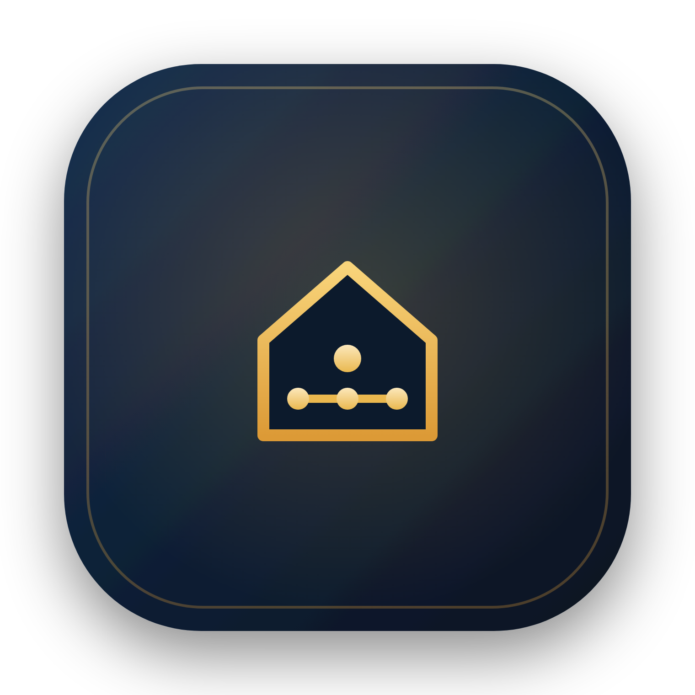
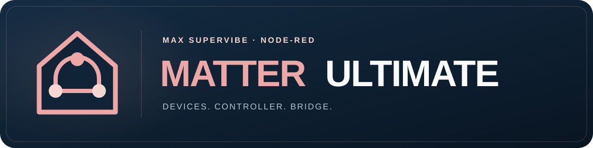
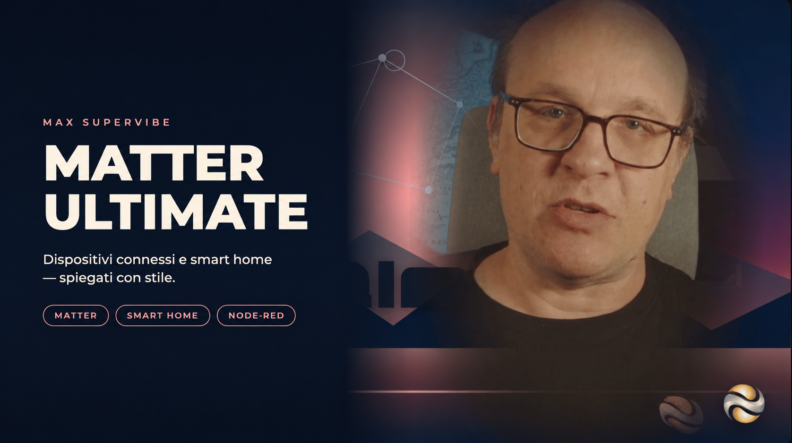

<p align="center">
  
</p>

<p align="center">
  
</p>

## Matter Controller and Bridge for Node-RED

Control real Matter devices with **Matter Controller**, or expose devices managed by your flows to a Matter app with **Matter Bridge**.

The nodes work directly with Node-RED messages: `msg.topic` identifies the function and `msg.payload` carries its value. KNX Ultimate is not required.

**You can also use this package with KNX Ultimate.** Its native integration connects commands and feedback directly to your existing KNX gateway, using group addresses and DPTs.

<br/>

[![NPM version][npm-version-image]][npm-url] [![Node.js version][node-version-image]][npm-url] [![Node-RED Flow Library][flows-image]][flows-url] [![Docs][docs-image]][docs-url] [![Commit activity][commit-activity-image]][commit-activity-url] [![Last commit][last-commit-image]][last-commit-url] [![NPM downloads per month][npm-downloads-month-image]][npm-url] [![NPM downloads in the last 18 months][npm-downloads-18-months-image]][npm-url] [![MIT License][license-image]][license-url] [![JavaScript Style Guide][standard-image]][standard-url] [![YouTube][youtube-image]][youtube-url]

<p align="center">
  <a href="https://www.youtube.com/channel/UCA9RsLps1IthT7fDSeUbRZw/playlists" title="Visit Max Supervibe on YouTube">
    
  </a>
</p>

<p align="left">
  <a href="https://supergiovane.github.io/node-red-contrib-matter-ultimate/en/index.html">📘 Go to documentation (English)</a><br/>
  <a href="https://supergiovane.github.io/node-red-contrib-matter-ultimate/it/index.html">📘 Vai alla documentazione (Italiano)</a><br/>
  <a href="https://supergiovane.github.io/node-red-contrib-matter-ultimate/de/index.html">📘 Zur Dokumentation (Deutsch)</a><br/>
  <a href="https://supergiovane.github.io/node-red-contrib-matter-ultimate/fr/index.html">📘 Accéder à la documentation (Français)</a><br/>
  <a href="https://supergiovane.github.io/node-red-contrib-matter-ultimate/es/index.html">📘 Ir a la documentación (Español)</a><br/>
  <a href="https://supergiovane.github.io/node-red-contrib-matter-ultimate/zh-CN/index.html">📘 前往文档（简体中文）</a><br/>
</p>

[![Changelog][changelog-image]](CHANGELOG.md)

## Installation

Requires Node.js >=20.18.1 and Node-RED >=3.1.1. This is the first public beta, available to everyone.

Run this command in your Node-RED user directory (usually `~/.node-red`), then restart Node-RED:

```sh
npm install node-red-contrib-matter-ultimate@beta
```

## Using Node-RED messages

Enable the input/output pins and enter topic names in the command and state fields. Leave the KNX gateway empty; DPT fields are hidden because they are not needed. Use separate command and state topics. Matching is exact; wildcards are not supported.

For example, in Matter Controller enter `living-room/brightness` in the brightness command field and send:

```js
msg.topic = "living-room/brightness";
msg.payload = 60;
return msg;
```

Use booleans for on/off, percentages for brightness, Kelvin for color temperature, and `{red, green, blue}` for RGB. Relative dimming uses the existing `{decr_incr, data}` value shape.

Controller state fields publish their values with the configured topic and `msg.payload`. Existing RAW messages remain supported, and RAW events remain available alongside mapped state messages. Command and state mappings keep their existing direction: for Matter Bridge, status-topic inputs update the virtual device and Matter commands appear on the configured command-topic outputs.

## KNX mode

**You can also use this package with KNX Ultimate.** The integration is native: install `node-red-contrib-knx-ultimate` and select its gateway to enable **KNX mode**. The same mapping fields then use group addresses and DPTs, with suggestions from the imported ETS project. Commands and feedback pass directly over the bus; no intermediate Function node is needed for these mappings.

When selecting a gateway, replace the saved topics with real group addresses and choose the correct DPTs. A selected gateway that is offline leaves the node in KNX mode. To return to Node-RED messages, clear the gateway and configure the topics again.

## Existing flows

On editor startup, the package looks for its legacy nodes and configuration nodes. It offers **Later** or **Back up and convert**. Nothing changes until you choose conversion. The conversion downloads a flow backup, preserves node IDs, wires, settings and configuration references, and creates one undo operation. Review the result before pressing **Deploy**.

Migrate and Deploy with **KNX Ultimate 7** still installed, before upgrading it to version 8. Keep KNX Ultimate installed if you use KNX mappings. The two packages use distinct public node types and admin routes and can run together. See [migration details](MIGRATION.md).

## Examples

[Importable examples](https://supergiovane.github.io/node-red-contrib-matter-ultimate/en/examples.html) explain setup and cover Node-RED messages and the optional KNX mode. The JSON files are also in [examples/](examples/).

## Development

```sh
npm install
npm test
npm pack
```

Hardware pairing and physical device operation still need validation on the intended installation before a stable release.

[license-image]: https://img.shields.io/badge/license-MIT-blue
[license-url]: LICENSE
[npm-url]: https://www.npmjs.com/package/node-red-contrib-matter-ultimate
[npm-version-image]: https://img.shields.io/npm/v/node-red-contrib-matter-ultimate/beta.svg
[node-version-image]: https://img.shields.io/node/v/node-red-contrib-matter-ultimate?logo=node.js&logoColor=white
[npm-downloads-month-image]: https://img.shields.io/npm/dm/node-red-contrib-matter-ultimate.svg
[npm-downloads-18-months-image]: https://img.shields.io/npm/d18m/node-red-contrib-matter-ultimate.svg
[standard-image]: https://img.shields.io/badge/code_style-standard-brightgreen.svg
[standard-url]: https://standardjs.com
[youtube-image]: https://img.shields.io/badge/YouTube-Playlists-red?logo=youtube&logoColor=white
[youtube-url]: https://www.youtube.com/channel/UCA9RsLps1IthT7fDSeUbRZw/playlists
[docs-image]: https://img.shields.io/badge/Docs-GitHub%20Pages-2ea44f
[docs-url]: https://supergiovane.github.io/node-red-contrib-matter-ultimate/
[commit-activity-image]: https://img.shields.io/github/commit-activity/m/Supergiovane/node-red-contrib-matter-ultimate?logo=github
[commit-activity-url]: https://github.com/Supergiovane/node-red-contrib-matter-ultimate/commits
[last-commit-image]: https://img.shields.io/github/last-commit/Supergiovane/node-red-contrib-matter-ultimate?logo=github
[last-commit-url]: https://github.com/Supergiovane/node-red-contrib-matter-ultimate/commits
[flows-image]: https://img.shields.io/badge/Node--RED-Flow%20Library-white?logo=nodered&logoColor=8F0000
[flows-url]: https://flows.nodered.org/node/node-red-contrib-matter-ultimate
[changelog-image]: https://img.shields.io/badge/CHANGELOG-ffc439?style=for-the-badge&logoColor=111111

---

<p align="center">
  
</p>
